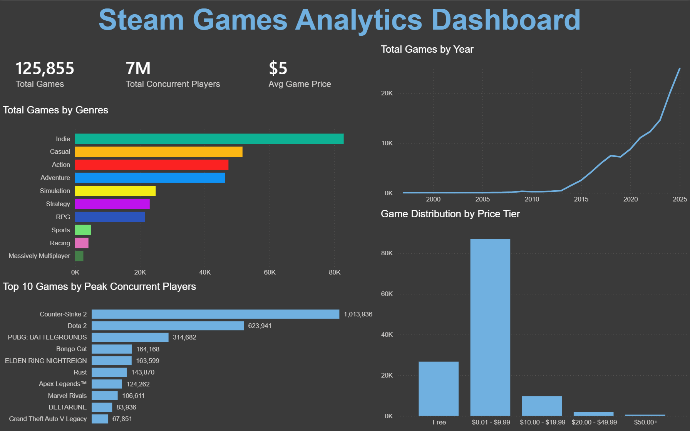

## Steam Games Analytics Dashboard V1 

A comprehensive Power BI data analytics dashboard analyzing over 125,000 games on Steam. This project examines catalog growth, market price distributions, top-performing titles by concurrent player count and genre-level market representation. (Data source: https://www.kaggle.com/datasets/fronkongames/steam-games-dataset/data) 

## Tools Used
• Power BI Desktop

• Power Query (Extract, Transform, Load - ETL)

• Star Schema / Bridge Table implementation for Many-to-Many relationships

• Data Analysis Expressions (DAX): Custom calculated measures (COUNTROWS, DISTINCTCOUNT, aggregations)

• UI/UX Design: Custom Dark Mode dashboard layout, color theory, grid alignment

## Challenges Encountered

Problem #1: Upon loading the data into Power Query it was obvious the data had shifted across columns such as "name" being under "release date" and so on.

Solution: I booted up Jupyter Notebook, imported Pandas and read in the CSV file. It became immediately clear that the problem was a header titled "DiscountDLC Count" which was supposed to be 2 seperate headers, so I used Python to correct the headers as well as drop various headers that were of no use to me such as "Screenshots" header that contained URL links etc I then exported the cleaned version and loaded it into Power BI. 

Problem #2: Raw game data contains multiple comma-separated genres per title (e.g., "Action, Indie, RPG"), which whilst normal for a game to be considered multiple genres it made standard visual filtering inaccurate and resulted in duplicate counts or unreadable category grouping. 

Solution: Created a dedicated game_genres bridge table in Power Query by splitting genre delimiters into individual rows. Established a bidirectional filter relationship across AppID between the master table and bridge table, enabling accurate cross-filtering without distorting game counts.

## Key Insights

• Indie games lead the Steam store catalog by a massive margin (~80k titles), followed by Casual and Action.

• The vast majority of Steam titles sit in the $0.01 – $9.99 price bracket, showing a high concentration of budget/indie games relative to standard $50+ AAA pricing.

• Steam saw exponential growth in total game releases starting around 2013–2015, accelerating into a massive uptick leading into 2025.

•  Counter-Strike 2 and Dota 2 remain heavyweights in peak concurrent player counts, commanding over 1M and 620K peak concurrent players respectively.

## Future Plans

As titled this dashboard is currently V1, in its current state is it finished and presents an executive summary regarding how big Steam is, dominating genres, average pricing etc however I believe there is much more data for me to dive into here as such I plan to make either a bigger dashboard or multiple Power BI reports aka multiple dashboards.

