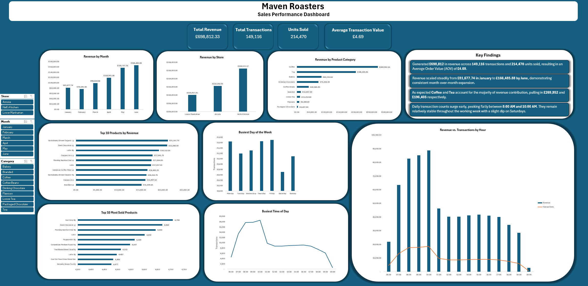

# Maven Roasters: Sales Performance & Operations Analysis

## Project Overview

This project analyzes 149k+ transactions ($£698k+$ total revenue) across three retail locations (Lower Manhattan, Astoria, and Hell's Kitchen) for Maven Roasters a fictional NYC-based coffee shop operating across three distinct locations.

The goal of this analysis is to evaluate revenue growth over time, identify peak operating hours and top-performing product categories, and deliver a fully interactive executive dashboard to guide business strategy.

Data Source: https://www.kaggle.com/datasets/agungpambudi/trends-product-coffee-shop-sales-revenue-dataset

## Key Insights & Findings

### 1. Revenue & Store Performance

**Total Performance:** Generated £698,812 in revenue across 149,116 transactions and 214,470 units sold, resulting in an Average Order Value (AOV) of £4.69.

**Store Breakdown:** Hell's Kitchen leads total revenue at £236,511, followed  by Astoria (£232,243.91) and Lower Manhattan (£230,057.25).

**Monthly Growth Trajectory:** Revenue scaled steadily from £81,677 in January to £166,485 by June, demonstrating consistent month-over-month expansion.

### 2. Product Categories & Top Performers

**Category Dominance:** As expected Coffee and Tea account for the majority of revenue contribution pulling in £269,952 and £196,405 respectively.

**Top Revenue Products:** Large sizes drive top-line growth, led by Sustainably Grown Organic Lg (£21,151.75) and Dark Chocolate Lg (£21,006.00).

**Volume Leaders:** Earl Grey Rg and Dark Chocolate Lg are the most sold products (4,708 and 4,668 units sold).

### 3. Operational Rush-Hours & Customer Behaviour

**Peak Transaction Volume:** Daily transaction counts surge early, peaking flatly between 8:00 AM and 10:00 AM.

**Revenue vs. Volume Insights:** Combining transaction counts with revenue through a secondary axis chart revealed that mid-morning customers (around 10:00 AM) purchase higher-value products compared to early morning customers.

**Weekly Consistency:** Transaction volumes remain relatively stable throughout the working week with a slight dip on Saturdays.

## Data Cleaning & Preparation: 

• Utilised filters to check the source dataset for duplicate rows, missing values etc

• Applied custom text cleanup utilising FIND & REPLACE operations alongside =PROPER() formatting to ensure consistent casing across product names and categories.

• Engineered time-formatting and categorisation helper columns to enable precise granular grouping by hour of day, day of week, and transaction month.

### Dashboard Design & Architecture

Designed an executive-grade, interactive business intelligence dashboard inside Microsoft Excel, optimised for visual hierarchy and user experience:

**Layout & Structure:** Built using a modern dark theme frame with structured white container cards to segregate global KPIs, core category breakdowns, product rankings and operational rush-hour trends.

**Interactive Control Panel:** Configured a dedicated left-hand sidebar containing global Slicers (Store Location, Month, and Product Category) connected via Report Connections to dynamically filter the entire dashboard simultaneously.

**Actionable Takeaways:** Integrated a dedicated Key Findings summary panel to translate raw visualisations directly into business insights.

## Tools Used
Microsoft Excel
